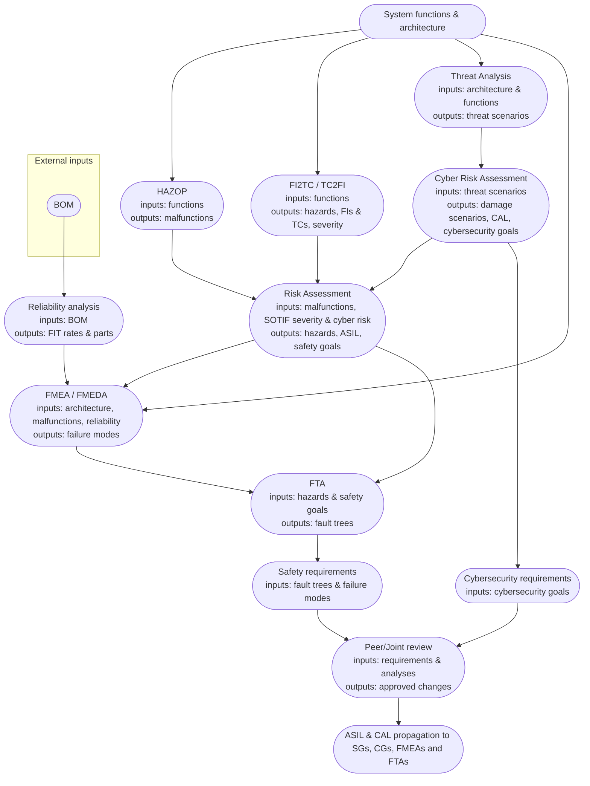
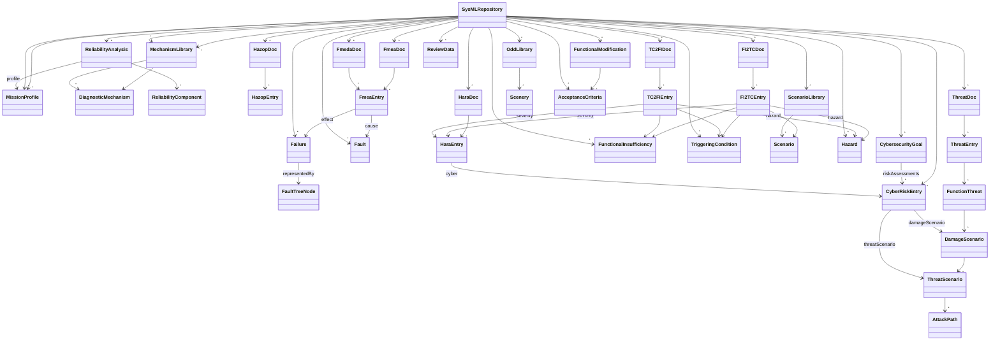

version: 0.1.5
Author: Miguel Marina <karel.capek.robotics@gmail.com> - [LinkedIn](https://www.linkedin.com/in/progman32/)
# AutoML

AutoML is an automotive modeling language. It lets you model items, operating scenarios, functions, structure and interfaces. The tool also performs **systems safety analyses**, including cybersecurity, following ISO 26262, ISO 21448, ISO 21434 and ISO 8800 standards. Recent updates add a **Review Toolbox** supporting peer and joint review workflows. The explorer pane now includes an **Analyses** tab organized into *System Design*, *Hazard Analysis*, *Risk Assessment* and *Safety Analysis* sections so documents and diagrams can be opened directly. Architecture objects can now be resized either by editing width and height values or by dragging the red handles that appear when an item is selected. Fork and join bars keep a constant thickness so only their length changes. **Deleting objects on a diagram now asks whether to remove them from the model or only from the current view. Removing from the model also deletes any part elements referencing it so names can be reused.** New FMEDA functionality automatically fills the violated safety goal from chosen malfunctions, supports selecting multiple malfunction effects and prevents assigning one malfunction to more than one top level event. Malfunctions can be added or removed via **Add** and **Delete** buttons in the FMEA/FMEDA dialogs, but deletion is blocked for malfunctions currently used in analyses or FTAs.

## Index

- [Workflow Overview](#workflow-overview)
- [HAZOP Analysis](#hazop-analysis)
- [Risk Assessment](#risk-assessment)
- [Requirements Creation and Management](#requirements-creation-and-management)
- [AutoML Diagrams and Safety Analyses](#automl-diagrams-and-safety-analyses)
- [Metamodel Overview](#metamodel-overview)
  - [AutoML Safety Extensions](#automl-safety-extensions)
  - [Core SysML Elements](#core-sysml-elements)
  - [Diagram Relationships](#diagram-relationships)
  - [Detailed Safety, Reliability and Cybersecurity Metamodel](#detailed-safety-reliability-and-cybersecurity-metamodel)
  - [Extended AutoML Element Attributes](#extended-automl-element-attributes)
- [BOM Integration with AutoML Diagrams](#bom-integration-with-automl-diagrams)
- [Component Qualifications](#component-qualifications)
- [Mission Profiles and Probability Formulas](#mission-profiles-and-probability-formulas)
- [SOTIF Analysis](#sotif-analysis)
  - [SOTIF Traceability](#sotif-traceability)
- [Cybersecurity Analysis](#cybersecurity-analysis)
  - [Safety and Cyber Governance](#safety-and-cyber-governance)
- [Review Toolbox](#review-toolbox)
- [Additional Tools](#additional-tools)
  - [Common Cause Toolbox](#common-cause-toolbox)
  - [Risk & Assurance Gate Calculator](#risk--assurance-gate-calculator)
  - [Product Goals Export](#product-goals-export)
  - [Safety Performance Indicators](#safety-performance-indicators)
  - [Safety Management Toolbox](#safety-management-toolbox)
- [Email Setup](#email-setup)
- [Dependencies](#dependencies)
- [Diagram Styles](#diagram-styles)
- [License](#license)
- [Building the Executable](#building-the-executable)
- [Version History](#version-history)

## Workflow Overview

The diagram below illustrates how information flows through the major work products. Each box lists the main inputs and outputs so you can see how analyses feed into one another and where the review workflow fits. Approved reviews update the ASIL and CAL values propagated throughout the model.



The workflow begins by entering system functions and architecture elements. A **BOM** is imported into a **Reliability analysis** which produces FIT rates and component lists used by the **FMEA/FMEDA** tables. A **HAZOP** analysis identifies malfunctions while the **FI2TC/TC2FI** tables capture SOTIF hazards, functional insufficiencies and triggering conditions along with their severities. In parallel, a **Threat Analysis** maps potential attack paths so the **Cyber Risk Assessment** can compute damage scenarios, risk levels and CALs. Those cybersecurity results feed the **risk assessment**, which combines them with malfunctions and SOTIF severities to assign hazards and ASIL ratings to safety goals that then inform FMEDAs and **FTA** diagrams. Cyber and safety goals produce corresponding requirement sets that converge in peer or joint **reviews**. When a review is approved any changes to requirements or analyses automatically update the ASIL and CAL values traced back to the safety goals, cybersecurity goals, FMEAs and FTAs.

## HAZOP Analysis

The **HAZOP Analysis** window lets you list system functions with one or more associated malfunctions. Each entry records the malfunction guideword (*No/Not*, *Unintended*, *Excessive*, *Insufficient* or *Reverse*), the related scenario, driving conditions and hazard, and whether it is safety relevant. Covered malfunctions may reference other entries as mitigation. When a function is allocated to an active component in a reliability analysis, its malfunctions become selectable failure modes in the FMEDA table.

## Risk Assessment

The **Risk Assessment** view builds on the safety relevant malfunctions from a selected HAZOP. When creating a new assessment you pick a HAZOP document from a drop-down; only malfunctions from that selection appear in the table. Each assessment table contains the following columns:

1. **Malfunction** – combo box listing malfunctions flagged as safety relevant in the chosen HAZOP document.
2. **Hazard** – textual description of the resulting hazard.
3. **Severity** – ISO&nbsp;26262 severity level (1–3). Values from FI2TC and
   TC2FI analyses are inherited here so the risk assessment reflects SOTIF hazards.
4. **Severity Rationale** – free text explanation for the chosen severity.
5. **Controllability** – ISO&nbsp;26262 controllability level (1–3).
6. **Controllability Rationale** – free text explanation for the chosen controllability.
7. **Exposure** – ISO&nbsp;26262 exposure level (1–4).
8. **Exposure Rationale** – free text explanation for the chosen exposure.
9. **ASIL** – automatically calculated from severity, controllability and exposure using the ISO&nbsp;26262 risk graph.
10. **Safety Goal** – combo box listing all defined safety goals in the project.
11. **Cyber Risk** – optional link to a cyber risk assessment entry so damage scenarios and CALs influence the hazard evaluation.

If a cyber risk entry is selected, its damage scenario and CAL are stored with the row for traceability to cybersecurity goals. The calculated ASIL from each row is propagated to the referenced safety goal so that inherited ASIL levels appear consistently in all analyses and documentation, including FTA top level events.

The **Hazard Explorer** window lists all hazards from every risk assessment in a read-only table for quick review or CSV export. A **Requirements Explorer** window lets you query global requirements with filters for text, type, ASIL and status.

## Requirements Creation and Management

Safety requirements are defined directly on FTA nodes and FMEA entries. In the edit dialog for a node or table row use **Add New** to create a fresh requirement or **Add Existing** to reuse one from the global registry. A new requirement records an ID and type such as vehicle, functional safety, technical safety, cybersecurity, production, service, operational or functional modification. Vehicle, functional safety, technical safety and cybersecurity requirements include ASIL and CAL values where applicable, while operational, production, service and functional modification requirements omit ASIL and CAL. Requirements can be split into two with the **Decompose** button which assigns ASIL values according to ISO 26262 decomposition rules. All requirements are stored in a project-wide list so they can be attached to multiple elements.

Open the **Requirements Matrix** from the Requirements menu to see every requirement with its allocation to basic events and any traced safety goals. The matrix view links to a **Requirements Editor** where you can add, edit or delete entries and modify traceability. Requirement statuses automatically change from draft to *in review*, *peer reviewed*, *pending approval* and finally *approved* as associated reviews progress. Updating a requirement reopens affected reviews so feedback is always tracked against the latest version.

## AutoML Diagrams and Safety Analyses

Use case, activity, block and internal block diagrams can be created from the **Architecture** menu. Diagrams are stored inside a built-in SysML repository and appear in the *Analyses* explorer under *System Design* so they can be reopened alongside safety documents. Each object keeps its saved size and properties so layouts remain stable when returning to the project.

Activity diagrams list individual **actions** that describe the expected behavior for a block. These actions can be referenced directly in HAZOP tables as potential malfunctions. When a block is linked to a reliability analysis, any actions in its internal block diagram are inherited as additional failure modes for that analysis. The inherited actions automatically show up in new FMEDA tables along with the failure modes already defined for the analysis components.

Elements on a diagram may reference reliability analyses. Choosing an **analysis** or **component** automatically fills the **fit**, **qualification** and **failureModes** fields using data from FMEA and FMEDA tables. These values show up in a *Reliability* compartment for blocks or below parts. When a block references an analysis, the components from that analysis BOM can be inserted as parts in the linked internal block diagram with their failure modes already listed.

Requirements can also be attached to diagram elements to keep architecture and safety analyses synchronized. The same safety goals referenced in HAZOP or risk assessment tables can therefore be traced directly to the blocks and parts that implement them.

## Metamodel Overview

Internally, AutoML stores all model elements inside a lightweight SysML repository. Each element is saved with its specific type—`BlockUsage`, `PartUsage`, `PortUsage`, `ActivityUsage`, `ActionUsage`, `UseCase`, `Actor` and so on. Links between these typed elements use the `SysMLRelationship` class. Diagrams such as use case or block diagrams are stored as `SysMLDiagram` objects containing the drawn **objects** and their **connections**. The singleton `SysMLRepository` manages every element, relationship, diagram and review so analyses stay consistent across the application. Each element ID is listed in an `element_diagrams` mapping so name or property updates propagate to every diagram where that element appears.

Every element, relationship and diagram records creation and modification metadata such as the author, email and timestamps. Blocks and parts expose additional reliability fields (`analysis`, `fit`, `qualification` and `failureModes`, plus `component` and `asil` on parts) so architecture elements remain linked to safety analyses.


### AutoML Safety Extensions

AutoML builds on this base by introducing domain specific stereotypes for safety
analysis. Hazards, faults and scenarios are stored using explicit types such as
`Hazard`, `Scenario`, `Scenery`, `SafetyGoal` and `FaultTreeNode`. Tables like
HAZOP or risk assessment reference these elements so analyses remain linked to the
architecture.


### Core SysML Elements

The repository tracks each element by its specific type rather than using the
generic `SysMLElement` placeholder. Key classes include:

- **BlockUsage** – structural block definition. Properties: `partProperties`,
  `ports`, `operations`, plus reliability attributes `analysis`, `fit`,
  `qualification` and `failureModes`.
- **PartUsage** – internal part with `component`, `failureModes` and `asil`
  fields for BOM links and safety ratings.
  Parts created automatically for composite aggregations set a `force_ibd`
  property so an internal block diagram is generated when the block structure is
  first opened.
- **PortUsage** – port on a block or part. Provides `direction`, `flow`,
  `labelX` and `labelY` to specify connector orientation.
- **ActivityUsage** – container for behaviors with `ownedActions` and
  `parameters`.
- **ActionUsage** – atomic step within an activity. Can be specialized as
  `CallBehaviorAction` to invoke another activity.
- **ControlFlow** and **ObjectFlow** – edges between actions. Control flows
  handle sequencing while object flows carry typed data.
- **Use Case** and **Actor** – high level functional views capturing external
  interactions.


### Diagram Relationships

Internal block diagrams provide structural views of a block. The diagram displays the block's parts and their ports so connectors can be drawn between them. Actions in activity diagrams may also reference an internal block diagram that explains the hardware interaction for that step.


### Detailed Safety, Reliability and Cybersecurity Metamodel

The tool stores each safety analysis in its own container object alongside the
SysML repository. These containers track the tables and diagrams loaded in the
GUI so analyses remain linked to the architecture. Key data classes include:



`ReliabilityAnalysis` records the selected standard, mission profile and overall
FIT results. Each `ReliabilityComponent` lists attributes like qualification,
quantity and a dictionary of part‑specific parameters. `MissionProfile`
instances capture on/off times and temperature ranges used when converting FIT
rates to probabilities. `MechanismLibrary` collections hold
`DiagnosticMechanism` entries from ISO 26262 Annex D so FMEDAs can select the
appropriate diagnostic coverage. `ScenarioLibrary` and `OddLibrary` objects
group reusable scenarios and ODD elements so HAZOP, risk assessment and FI2TC/TC2FI tables
share a consistent context. HAZOP and risk assessment tables use `HazopDoc`/`HazopEntry`
and `HaraDoc`/`HaraEntry` pairs to store their rows. FMEA and FMEDA tables are
stored as `FmeaDoc` and `FmedaDoc` with lists of generic `FmeaEntry`
dictionaries capturing the failure mode, cause, detection rating and diagnostic
coverage. Fault tree diagrams consist of nested `FaultTreeNode` objects that hold
FMEA metrics, FMEDA values and traced requirements. Cybersecurity analyses use
`ThreatDoc` and `CyberRiskEntry` records to capture STRIDE-based threat
scenarios, attack paths and damage assessments. Each `CyberRiskEntry`
computes impact, risk level and CAL while linked `CybersecurityGoal`
collections store the highest resulting CAL to support ISO 21434 compliance.

The diagram below shows how a threat analysis links to its cybersecurity risk
assessment and resulting goal. Each risk entry records the attack vector,
feasibility and four impact categories before deriving the overall impact,
resulting risk level and Cybersecurity Assurance Level (CAL).


#### Analysis Relationships

The diagram below shows how reliability calculations flow into FMEDA tables and fault trees.


Blocks reference a `ReliabilityAnalysis` which lists its components. Parts link directly to the matching `ReliabilityComponent`. Malfunctions selected from `HazopEntry` rows become `FmeaEntry` failure modes tied to those components. The base FIT for each `ReliabilityComponent` feeds into FMEDA tables so a separate FIT is calculated for every failure mode. These FMEDA entries can spawn `FaultTreeNode` base events inside an FTA diagram so probabilities and coverage remain synchronized with the reliability analysis.

#### Hazard Traceability

The next diagram traces how malfunctions detected in a HAZOP flow through the safety analyses. Actions in activity diagrams become `HazopEntry` malfunctions linked to operational `Scenario` objects and their `Scenery` from the ODD. Selected HAZOP rows populate `HaraEntry` items where Severity × Exposure × Controllability determine the ASIL and resulting `SafetyGoal`. When cyber risks are relevant, each `HaraEntry` can reference a `CyberRiskEntry` so damage scenarios influence the hazard analysis. Safety goals appear as the top level events in FTAs. FMEDA failure modes and architecture components create `FaultTreeNode` base events that generate safety `Requirement` objects. Requirements may be decomposed into children with reduced ASIL values when ISO 26262 decomposition rules apply.


#### Review Data Structure


Each review stores its moderators, participants and comment threads along with
the names or IDs of the analyses being evaluated.

#### Differences From Standard SysML

- **BlockUsage** – extends the standard `Block` with reliability information:
  `analysis`, `fit`, `qualification` and `failureModes` link architecture
  elements to FMEA tables.
- **PartUsage** – extends `PartProperty` by referencing a BOM `component`,
  listing applicable `failureModes` and storing the assigned `asil` level.
- **SafetyGoal** – specialization of `Requirement` holding a textual
  `description`, `asil` rating and quantitative targets `spfm`, `lpfm` and `dc`.
- **Hazard** – extends `SysMLElement` with a hazard `description` and risk assessment
  `severity` plus the related `scenarios`.
- **Scenario** – extends `SysMLElement` to include a short `description`, linked
  `scenery` context and traced `hazards`.
- **Scenery** – extends `SysMLElement` with the `odd_element` name and flexible
  context `attributes` describing that environment.
- **FaultTreeNode** – extends `SysMLElement` by storing FMEA fields
  `fmea_effect` and `fmea_cause`, FMEDA metrics and traced
  `safety_requirements`.
- **ReliabilityAnalysis** – specialization of `AnalysisDocument` capturing the
  selected reliability `standard`, mission `profile`, aggregated `total_fit` and
  resulting `spfm`, `lpfm` and `dc` values.
- **ReliabilityComponent** – extends `SysMLElement` with component `name`,
  qualification certificate, `quantity`, parameter `attributes` and computed
  `fit` rate.
- **FmeaDoc** – specialized `AnalysisDocument` holding the failure mode table
  with occurrence and detection ratings.
- **FmeaEntry** – extends `SysMLElement` with `failure_mode`, `cause`, `effect`,
  `severity`, `occurrence` and `detection` data.
- **FmedaDoc** – specialized `AnalysisDocument` whose table-level metrics
  `spfm`, `lpfm` and `dc` are calculated from failure mode FIT values.
- **FaultTreeDiagram** – specialization of `SysMLDiagram` storing the overall
  fault tree probability `phmf` and Prototype Assurance Level `pal`.
- **TriggeringCondition** – extends `SysMLElement` with a textual
  `description`, the related `scenario` and any allocated acceptance criteria.
- **FunctionalInsufficiency** – extends `SysMLElement` with the missing function
  `description`, associated `scenario` and impacted `safetyGoal`.
- **FunctionalModification** – extends `SysMLElement` to record the mitigation
  text and linked `acceptanceCriteria` used to verify the change.
- **AcceptanceCriteria** – extends `SysMLElement` with a measurable condition
  proving a functional modification resolves the hazard.
- **Fault** – extends `SysMLElement` to describe the underlying cause leading to
  a failure mode.
- **Failure** – extends `SysMLElement` to record the malfunction effect used as
  an FMEA failure mode and FTA event.
- **MechanismLibrary** – aggregates `DiagnosticMechanism` definitions that can
  be referenced by FMEDAs. Each mechanism stores a `coverage` value along with a
  short `description`, implementation `detail` and optional `requirement`.
- **MissionProfile** – captures the on/off time, temperatures and other
  environmental parameters for reliability calculations.
- **ScenarioLibrary** – groups reusable `Scenario` entries so analyses share the
  same operational contexts.
- **OddLibrary** – lists `Scenery` elements describing ODD attributes such as
  road features or environmental limits.
- **ReviewData** – stores peer or joint review sessions with moderators,
  participants, review comments and lists of referenced analyses.
- **ThreatDoc** – container for a threat analysis document with a `name`,
  reference `diagram` and `entries` describing assets and functions.
- **ThreatEntry** – links an `asset` to the affected system `functions` for
  further analysis.
- **FunctionThreat** – associates a function `name` with possible
  `damage_scenarios`.
- **DamageScenario** – potential damage `scenario` and type `dtype` that groups
  related threat scenarios.
- **ThreatScenario** – STRIDE-based `stride` category, textual `scenario` and
  optional attack paths.
- **AttackPath** – description of a single attack path that could realize the
  threat.
- **CyberRiskEntry** – risk assessment values for a threat scenario including
  `attack_vector`, `feasibility`, impact ratings, derived `overall_impact`,
  `risk_level` and resulting `cal`.
- **HaraEntry** – risk assessment row linking a malfunction and scenario to an
  optional `cyber` reference so damage scenarios influence safety hazards.
- **CybersecurityGoal** – textual goal `description`, `goal_id` and computed
  highest `cal` across linked risk assessments.

### Extended AutoML Element Attributes

AutoML elements include additional properties beyond the standard SysML fields.
Key attributes are:

- **SafetyGoal** – textual `description`, assigned `asil` level and quantitative
  targets `spfm`, `lpfm` and `dc`. Each goal also lists allocated safety
  `requirements`.
- **Hazard** – hazard `description`, risk assessment `severity` and the related
  `scenarios` that can lead to it.
- **Scenario** – short `description`, linked `scenery` context and traced
  `hazards`.
- **Scenery** – stores the `odd_element` name and an open-ended set of
  context attributes describing that element.
- **FaultTreeNode** – FMEA fields (`fmea_effect`, `fmea_cause`, `fmea_severity`,
  `fmea_occurrence`, `fmea_detection`, `fmea_component`), FMEDA metrics
  (`fmeda_malfunction`, `fmeda_safety_goal`, `fmeda_diag_cov`, `fmeda_fit`,
  `fmeda_spfm`, `fmeda_lpfm`, `fmeda_fault_type`, `fmeda_fault_fraction`,
  `fmeda_dc_target`, `fmeda_spfm_target`, `fmeda_lpfm_target`), safety goal data
  (`safety_goal_description`, `safety_goal_asil`, `safe_state`, `ftti`,
  `validation_target`, `validation_desc`, `acceptance_criteria`, `sg_dc_target`,
  `sg_spfm_target`, `sg_lpfm_target`), probability attributes (`failure_prob`, `probability`,
  `prob_formula`), plus `fault_ref`, `malfunction` and linked
  `safety_requirements`.
- **ReliabilityAnalysis** – selected `standard`, mission `profile`, aggregated
  `total_fit` and resulting `spfm`, `lpfm` and `dc` values.
- **ReliabilityComponent** – component `name`, qualification certificate,
  `quantity`, parameter `attributes` and computed `fit` rate.
- **MissionProfile** – `tau_on`, `tau_off`, board and ambient temperature
  ranges, `humidity`, `duty_cycle` and optional `notes` describing operating
  conditions.
- **FmeaDoc** – failure mode table with occurrence and detection ratings.
- **FmedaDoc** – table-level metrics `spfm`, `lpfm` and `dc` calculated from
  failure mode FIT values.
- **MechanismLibrary** – named collection of diagnostic mechanisms.
- **DiagnosticMechanism** – mechanism `name`, expected `coverage` and
  descriptive fields `description`, `detail` and `requirement`.
- **FaultTreeDiagram** – overall fault tree probability `phmf` and Prototype
  Assurance Level `pal`.
- **TriggeringCondition** – `description`, related `scenario` and any allocated
  acceptance criteria.
- **FunctionalInsufficiency** – description of the missing function,
  associated `scenario` and the impacted `safetyGoal`.
- **FunctionalModification** – mitigation text and link to one or more
  `acceptanceCriteria` used to verify the change.
- **AcceptanceCriteria** – measurable condition proving a functional
  modification resolves the hazard.
- **MechanismLibrary** – library `name` and list of `DiagnosticMechanism`
  definitions that provide diagnostic coverage values.
- **DiagnosticMechanism** – `coverage`, `description`, implementation `detail`
  and optional `requirement` text.
- **MissionProfile** – `tau_on`, `tau_off`, `board_temp`, `ambient_temp`,
  `humidity`, `duty_cycle` and free-form `notes` describing operating
  conditions.
- **ScenarioLibrary** – `name` plus a list of `scenarios` and referenced ODD
  elements.
- **OddLibrary** – `name` and collection of `Scenery` entries describing ODD
  attributes.
- **Fault** - underlying cause leading to a failure mode.
- **Failure** - malfunction effect used as an FMEA failure mode and FTA event.
- **ReviewData** - review `mode`, lists of `moderators` and `participants`,
  referenced analysis names and a collection of `comments`.
- **SysMLObject** – drawn object with coordinates, size and an optional linked
  element. The `locked` flag prevents editing while `hidden` temporarily removes
  the object from the diagram.
- **DiagramConnection** – connector between objects storing the connection
  `style`, optional arrowheads, intermediate points and a `mid_arrow` toggle for
  aggregation lines.

**BlockUsage** – extends `Block` with reliability fields like `analysis`, `fit`, `qualification` and `failureModes`.


**PartUsage** – extends `PartProperty` with `component`, `failureModes` and `asil` fields.


**SafetyGoal** – specialization of `Requirement` with `asil` and FMEDA metrics (`spfm`, `lpfm`, `dc`).


**Hazard** – extends `SysMLElement` to store the hazard `description` and risk assessment `severity`.


**Scenario** – extends `SysMLElement` with a short `description` and linked `scenery`.


**Scenery** – extends `SysMLElement` with an `odd_element` name and descriptive `attributes`.


**FaultTreeNode** – specialized `SysMLElement` capturing FMEA and FMEDA data for FTA events.


**ReliabilityAnalysis** – extends `AnalysisDocument` to store mission profile and cumulative FIT metrics.


**ReliabilityComponent** – extends `SysMLElement` with component data like `name`, `qualification`, `quantity`, `attributes` and `fit`.


**MissionProfile** – records operating and environmental conditions for reliability calculations.


**MechanismLibrary** – collection of diagnostic mechanisms with coverage data.

```mermaid
classDiagram
    class MechanismLibrary {
        name
        mechanisms
    }
```

**DiagnosticMechanism** – individual safety mechanism and its expected coverage.

```mermaid
classDiagram
    class DiagnosticMechanism {
        name
        coverage
        description
        detail
        requirement
    }
```

**AnalysisDocument** – base class for safety tables with `name`, `date` and `description`.


```mermaid
classDiagram
    class AnalysisDocument {
        name
        date
        description
    }
    SysMLElement <|-- AnalysisDocument
```

**FmeaDoc** – extends `AnalysisDocument` for FMEA tables with an `rpn_threshold`.

```mermaid
classDiagram
    class FmeaDoc {
        rpn_threshold
    }
    AnalysisDocument <|-- FmeaDoc
```

**FmeaEntry** – extends `SysMLElement` with failure mode data including `cause`, `effect`, `severity`, `occurrence` and `detection`.

```mermaid
classDiagram
    class FmeaEntry {
        failure_mode
        cause
        effect
        severity
        occurrence
        detection
    }
    SysMLElement <|-- FmeaEntry
```

**FmedaDoc** – another `AnalysisDocument` variant storing table-level `spfm`, `lpfm` and `dc` metrics.

```mermaid
classDiagram
    class FmedaDoc {
        spfm
        lpfm
        dc
    }
    AnalysisDocument <|-- FmedaDoc
```
**FaultTreeDiagram** – specialization of `SysMLDiagram` storing overall probability `phmf` and Prototype Assurance Level `pal`.


```mermaid
classDiagram
    class FaultTreeDiagram {
        phmf
        pal
    }
    SysMLDiagram <|-- FaultTreeDiagram
```

**TriggeringCondition** – extends `SysMLElement` with a `description`, linked `scenario` and associated acceptance criteria.

```mermaid
classDiagram
    class TriggeringCondition {
        description
        scenario
        acceptanceCriteria
    }
    SysMLElement <|-- TriggeringCondition
```

**FunctionalInsufficiency** – extends `SysMLElement` with a failure `description`, linked `scenario` and impacted `safetyGoal`.

```mermaid
classDiagram
    class FunctionalInsufficiency {
        description
        scenario
        safetyGoal
    }
    SysMLElement <|-- FunctionalInsufficiency
```

**FunctionalModification** – extends `SysMLElement` with mitigation `text` and linked acceptance criteria.

```mermaid
classDiagram
    class FunctionalModification {
        text
        acceptanceCriteria
    }
    SysMLElement <|-- FunctionalModification
```
**AcceptanceCriteria** – extends `SysMLElement` with a textual description verifying a functional modification.


```mermaid
classDiagram
    class AcceptanceCriteria {
        description
    }
    SysMLElement <|-- AcceptanceCriteria
```
**Fault** – extends `SysMLElement` to describe an underlying cause leading to a failure mode.

```mermaid
classDiagram
    class Fault {
        description
    }
    SysMLElement <|-- Fault
```

**Failure** – extends `SysMLElement` to capture a malfunction effect and its `severity`.

```mermaid
classDiagram
    class Failure {
        description
        severity
    }
    SysMLElement <|-- Failure
```

**ReviewData** – captures the participants and comments for peer or joint reviews.

```mermaid
classDiagram
    class ReviewParticipant {
        name
        email
        role
        done
        approved
        reject_reason
    }
    class ReviewComment {
        comment_id
        node_id
        text
        reviewer
        target_type
        req_id
        field
        resolved
        resolution
    }
    class ReviewData {
        name
        description
        mode
        moderators
        participants
        comments
        fta_ids
        fmea_names
        fmeda_names
        hazop_names
        hara_names
        due_date
        closed
        approved
        reviewed
    }
    ReviewData --> "*" ReviewParticipant : participants
    ReviewData --> "*" ReviewParticipant : moderators
    ReviewData --> "*" ReviewComment : comments
```

## BOM Integration with AutoML Diagrams

Blocks in block diagrams may reference saved reliability analyses via the **analysis** property while parts reference individual components using the **component** property. Both element types also provide **fit**, **qualification** and **failureModes** attributes. Entering values for these fields shows them in a *Reliability* compartment for blocks or as additional lines beneath parts so FIT rates and qualification information remain visible in the AutoML model. When editing a block or part you can now pick from drop-down lists containing all analyses or components from saved reliability analyses. Selecting an item automatically fills in its FIT rate, qualification certificate and any failure modes found in FMEA tables.

## Component Qualifications

Reliability calculations take the qualification certificate of each passive component into account. When computing FIT rates, a multiplier based on the certificate (e.g. *AEC‑Q200* or *MIL‑STD‑883*) is applied so qualified parts yield lower failure rates. Active components currently use a neutral factor. Additional datasheet parameters such as diode forward voltage or MOSFET `RDS(on)` can be entered when configuring components to better document the parts used in the analysis.

## Mission Profiles and Probability Formulas

The **Reliability** menu lets you define mission profiles describing the on/off time, temperatures and other conditions for your system. When a profile is present its total `TAU` value is used to convert FIT rates into failure probabilities for each basic event.

In the *Edit Node* dialog for a basic event you can choose how the FIT rate is interpreted:

* **linear** – probability is calculated as `λ × τ` where `λ` is the FIT value expressed as failures per hour and `τ` comes from the selected mission profile.
* **exponential** – uses the exponential model `1 − exp(−λ × τ)`.
* **constant** – probability comes from the basic event's *Failure Probability* field and does not use the FIT rate or mission time.

Mission profiles and the selected formula for each basic event are stored in the JSON model so results remain consistent when reloading the file.

## SOTIF Analysis

The **Qualitative Analysis** menu also provides dedicated SOTIF tools. Selecting **Triggering Conditions** or **Functional Insufficiencies** opens read-only lists of each node type with an **Export CSV** button. These views gather all triggering condition and functional insufficiency nodes from the FTAs so the information can be reviewed separately.

Two additional tables support tracing between these elements:

* **FI2TC Analysis** – analogue of HAZOP for SOTIF. Each row links a functional
  insufficiency to the triggering conditions, scenarios and mitigation measures
  that reveal the hazard. The hazard and its **severity** are recorded here. The
  table includes dedicated **triggering_conditions** and
  **functional_insufficiencies** columns populated via comboboxes so new items
  can be added on the fly. The **design_measures** column now shows a list of
  allocated functional modification requirements with **Add New** and
  **Add Existing** buttons just like FTA nodes. Selected requirements appear in
  the listbox and can be edited or removed individually.
* **TC2FI Analysis** – also mirrors HAZOP concepts for SOTIF. It starts from the
  triggering condition and lists the impacted functions, architecture elements
  and related insufficiencies. The identified hazard and its **severity** are
  noted in each entry. The **triggering_conditions** and
  **functional_insufficiencies** fields mirror those in the FI2TC table to keep
  the relationships consistent.

Severity recorded in FI2TC and TC2FI entries is inherited by the risk assessment so the risk graph reflects the SOTIF findings. Other risk assessment values such as the associated safety goal flow into these tables so SOTIF considerations remain connected to the overall risk assessment. Minimal cut sets calculated from the FTAs highlight combinations of FIs and TCs that form *CTAs*. From a CTA entry you can generate a functional modification requirement describing how the design must change to avoid the unsafe behaviour.

All FI2TC and TC2FI documents appear in the *Hazard Analysis* section of the **Analyses** tab so they can be opened alongside risk assessment tables, FTAs and CTAs for a complete view of functional safety and SOTIF issues.

### SOTIF Traceability

The following diagram shows how triggering conditions, functional insufficiencies and functional modifications connect scenarios to safety goals and fault trees. FI2TC and TC2FI tables cross‑reference these elements and record the acceptance criteria for each mitigation.

```mermaid
classDiagram
    class Scenario
    class SafetyGoal
    class TriggeringCondition
    class FunctionalInsufficiency
    class FI2TCDoc
    class TC2FIDoc
    class Hazard
    class HaraEntry
    class FunctionalModification
    class AcceptanceCriteria
    class FaultTreeDiagram
    class FaultTreeNode
    Scenario --> TriggeringCondition : triggers
    Scenario --> FunctionalInsufficiency : reveals
    TriggeringCondition --> FI2TCDoc : entry
    FunctionalInsufficiency --> FI2TCDoc : entry
    TriggeringCondition --> TC2FIDoc : entry
    FunctionalInsufficiency --> TC2FIDoc : entry
    FunctionalInsufficiency --> FunctionalModification : mitigatedBy
    FunctionalModification --> AcceptanceCriteria : validatedBy
    FI2TCDoc --> Hazard : hazard
    TC2FIDoc --> Hazard : hazard
    FI2TCDoc --> HaraEntry : severity
    TC2FIDoc --> HaraEntry : severity
    SafetyGoal --> FaultTreeDiagram : topEvent
    FaultTreeDiagram --> "*" FaultTreeNode : nodes
    TriggeringCondition --> FaultTreeNode : cta
    FunctionalInsufficiency --> FaultTreeNode : cta
```

## Cybersecurity Analysis

AutoML includes cybersecurity assessments alongside traditional safety tools.
The **Cyber Risk Assessment** view evaluates damage scenarios, threat
scenarios and attack vectors to compute overall impact, risk level and
Cybersecurity Assurance Level (CAL). Each row may reference a
`CybersecurityGoal`, which aggregates the highest CAL from its linked
risk assessments.

### Safety and Cyber Governance

The governance model below illustrates how safety and cybersecurity
activities converge during reviews.

```mermaid
flowchart TD
    A([Threat Analysis]) --> B([Cyber Risk Assessment])
    B --> C([Cybersecurity Goals])
    A --> D([Hazard Analysis])
    D --> E([Safety Goals])
    C & E --> F([Governance Review])
    F --> G([Mitigations Implemented])
```

Threat analyses feed cyber risk assessments and ultimately cybersecurity
goals, while hazard analyses inform safety goals. Both goal sets flow
into a combined governance review that drives the implementation of
mitigations across safety and security domains.

## Review Toolbox

Launch the review features from the **Review** menu:

* **Start Peer Review** – create at least one moderator and one reviewer, then tick the checkboxes for the FTAs and FMEAs you want to include. Each moderator and participant has an associated email address. A due date is requested and once reached the review becomes read‑only unless a moderator extends it. A document window opens showing the selected elements. FTAs are drawn on canvases you can drag and scroll, while FMEAs appear as full tables listing every field so failures can be reviewed line by line. Linked requirements are listed below and any text changes are colored the same way as other differences. Changes to which requirements are allocated to each item are highlighted in blue and red.
* **Start Joint Review** – add participants with reviewer or approver roles and at least one moderator, select the desired FTAs and FMEAs via checkboxes and enter a unique review name and description. Approvers can approve only after all reviewers are done and comments resolved. Moderators may edit the description, due date or participant list later from the toolbox. The document window behaves the same as for peer reviews with draggable FTAs and tabulated FMEAs. Requirement diffs are also shown in this view.
* Closing a joint review asks for a baseline name which is combined with the automatically incremented version, for example "v4 - baseline_00_98_23". This label appears in the **Compare Versions** dialog.
* **Open Review Toolbox** – manage comments. Selecting a comment focuses the related element and shows the text below the list. Use the **Open Document** button to reopen the visualization for the currently selected review. A drop-down at the top lists every saved review with its approval status.
* **Merge Review Comments** – combine feedback from another saved model into the current one so parallel reviews can be consolidated.
* **Compare Versions** – view earlier approved versions. Differences are listed with a short description and small before/after images of changed FTA nodes. Requirement allocations are compared in the diagrams and logs.
* **Set Current User** – choose who you are when adding comments. The toolbox also provides a drop-down selector.
* **Update Decomposition** – after splitting a requirement into two, select either child and use the new button in the node dialog to pick a different ASIL pair.
* The target selector within the toolbox only lists nodes and FMEA items that were chosen when the review was created, so comments can only be attached to the scoped elements.

Nodes with unresolved comments show a small yellow circle to help locate feedback quickly. When a review document is opened it automatically compares the current model to the previous approved version. Added elements appear in blue and removed ones in red just like the **Compare Versions** tool, but only for the FTAs and FMEAs included in that review.

When comparing versions, added nodes and connections are drawn in blue while removed ones are drawn in red. Text differences highlight deleted portions in red and new text in blue so changes to descriptions, rationales or FMEA fields stand out. Deleted links between FTA nodes are shown with red connectors. Requirement lists are compared as well so allocation changes show up alongside description and rationale edits. The Requirements Matrix window now lists every requirement with the nodes and FMEA items where it is allocated and the safety goals traced to each one.

Comments can be attached to FMEA entries and individual requirements. Resolving a comment prompts for a short explanation which is shown with the original text.

Review information (participants, comments, review names, descriptions and approval state) is saved as part of the model file and restored on load.

## Additional Tools

### Common Cause Toolbox

The **Common Cause Toolbox** groups failures that share the same cause across FMEAs, FMEDAs and FTAs. It highlights events that may lead to common cause failures and supports exporting the aggregated list to CSV.

### Risk & Assurance Gate Calculator

A built-in calculator derives a Prototype Assurance Level (PAL) from confidence, robustness and direct assurance inputs. Gates aggregate assurance from child nodes to help judge whether additional testing or design changes are needed before road trials.

### Product Goals Export

Use **Export Product Goal Requirements** in the Requirements menu to generate a CSV listing each product goal with its associated requirements and ASIL ratings.

### Safety Performance Indicators

The **Safety Performance Indicators** tool in the Safety Management tab
aggregates each product goal's validation target and acceptance criteria with
its safety and AI metrics. Safety metrics such as SPFM, LPFM and DC, along with
AI-specific measures like false-negative or precision rates, can be compared
against the planned validation targets. This view highlights how acceptance
criteria translate into measurable indicators and whether current performance
meets the required safety objectives.

### Safety Management Toolbox

The **Safety Management Toolbox** lets you organize safety work products across the entire lifecycle. You can define phases, attach tailored work products from any diagram or analysis with a supporting rationale, and capture workflows that govern how these items interact. The resulting lifecycle and workflow definition can be exported as a JSON business diagram to document your safety governance process.

### Acceptance Criteria and Validation Targets

ISO 21448 provides a method to derive a validation target from an acceptance
criterion by analysing the rate of the hazardous behaviour :math:`R_{HB}`.
The **acceptance rate** :math:`A_H` represents the tolerated rate of harm
in events per hour. Product goals also record the operational hours spent in
the system's ON state for which the acceptance criterion applies. The derived
validation target is the corresponding rate of hazardous behaviour
:math:`R_{HB}` that should not be exceeded. A mission profile from the model
can be selected to define the operating context for this validation target. Given
conditional probabilities for exposure :math:`P_{E|HB}`, uncontrollability
:math:`P_{C|E}` and severity :math:`P_{S|C}`, the acceptable rate of the
hazardous behaviour is computed as:

```
R_HB = A_H / (P_{E|HB} * P_{C|E} * P_{S|C})
```

This value can serve as a validation target when planning tests. For example,
an acceptance criterion of ``1e-8/h`` with ``P_{E|HB}=0.05``,
``P_{C|E}=0.1`` and ``P_{S|C}=0.01`` yields ``R_HB = 2e-4/h``. Because the
conditional probabilities are often very small, even moderate acceptance
rates can produce seemingly large validation targets.

The product goal editor derives exposure, controllability and severity
probabilities from their risk assessment ratings and shows them as read-only
fields. Only the acceptance rate is editable; the validation target is then
computed automatically.

The following rule-of-thumb probabilities are used to convert ISO 26262/21448
ratings into conditional probabilities. Each step increases the likelihood by
roughly an order of magnitude and represents values commonly referenced in
industry practice:

| Rating | P(E\|HB) | P(C\|E) | P(S\|C) |
|-------:|----------:|---------:|---------:|
| 1      | 1×10⁻⁴    | 1×10⁻³   | 1×10⁻³   |
| 2      | 1×10⁻³    | 1×10⁻²   | 1×10⁻²   |
| 3      | 1×10⁻²    | 1×10⁻¹   | 1×10⁻¹   |
| 4      | 1×10⁻¹    | –        | –        |

Projects with empirical data may substitute more precise values, but these
approximations provide a justified starting point when none are available.

These acceptance criteria and validation targets form the baseline for Safety
Performance Indicators. Observed safety or AI metrics are traced back to these
targets so stakeholders can validate whether the established acceptance
criteria are met throughout development and testing.

## Email Setup

When sending review summaries, the application asks for SMTP settings and login details. If you use Gmail with two-factor authentication enabled, create an **app password** and enter it instead of your normal account password. Authentication failures will prompt you to re-enter these settings.

Each summary email embeds PNG images showing the differences between the current model and the last approved version for the selected FTAs so reviewers can view the diagrams directly in the message. CSV files containing the FMEA tables are attached so they can be opened in Excel or another spreadsheet application. Requirement changes with allocations and safety goal traces are listed below the diagrams.

If sending fails with a connection error, the dialog will prompt again so you can correct the server address or port.

## Dependencies

AutoML relies on a few third‑party Python packages which must be installed
before running the tool or creating the executable. Install them with pip:

```
pip install pillow openpyxl networkx matplotlib reportlab adjustText
```

PyInstaller requires these packages to be present so they are bundled into
`AutoML.exe`. Missing dependencies, such as Pillow, will otherwise lead to
`ModuleNotFoundError` when launching the built executable.

Note that Pillow provides the `PIL` module. The build scripts now verify
dependencies with `python -m pip show` so the correct interpreter is used and
pass `--hidden-import=PIL.ImageTk` to PyInstaller to ensure the module is
bundled correctly.

If double‑clicking `AutoML.py` closes immediately, launch it from a command
prompt instead so any error messages remain visible.

## Diagram Styles

Several XML files in the `styles` directory control the colors used for
diagram elements. The default style `pastel.xml` provides softer tones like
peach actions and steel-blue nodes. `modern.xml` offers a Material-inspired
palette for a different look. Open the Style Editor via **View → Style Editor**, click **Load** and choose
the desired style. All open diagrams update immediately.

## License

This project is licensed under the GNU General Public License version 3. See the [LICENSE](LICENSE) file for details.

## Building the Executable
To create a standalone Windows executable with PyInstaller:

- **Linux/macOS:** run `bin/build_exe.sh`
- **Windows:** run `bin\build_exe.bat`

You can invoke these scripts from any directory; they locate the repository
root automatically. Both generate `AutoML.exe` inside the `bin` directory.
After building you can launch the application directly or use
`bin/run_automl.sh` on Unix-like systems or `bin\run_automl.bat` on
Windows.

If a previous build failed and left an `AutoML.spec` file behind, the build
scripts now delete it before running PyInstaller so your command line
options are always applied.

The scripts exclude the `scipy` package, which is not required by AutoML but
can cause PyInstaller to fail on some Python installations. If you encounter
errors about ``IndexError`` while building, try upgrading your Python runtime
or reinstalling SciPy. This is most common when using a pre-release Python
interpreter (e.g. ``3.10.0rc2``). Install the latest stable release of Python
and run the build again if you hit this issue.


## Version History
- 0.1.5 - Added a pastel style with peach actions and steel-blue nodes.
- 0.1.4 - Initial diagram style support documented.
- 0.1.3 - Added context menu actions to remove parts from a diagram or from the model.
- 0.1.2 - Clarified systems safety focus in description and About dialog.
- 0.1.1 - Updated description and About dialog.
- 0.1.0 - Added Help menu and version tracking.
## Example Safety Analysis Tables

The following example shows how to build a small project from scratch so you can
follow the full safety workflow yourself. Start with these setup steps:

### Project Setup

1. Install the required packages:
   ```
   pip install pillow openpyxl networkx matplotlib reportlab adjustText
   ```
2. Launch AutoML with `python AutoML.py` and choose **File → New Project**.
3. Create an activity diagram named **Stop at Intersection**:
   - **Diagram → Activity → New**
   - Add an initial node, an action called *Braking*, and a final node.
   - Save the diagram. HAZOP entries reference actions from activity diagrams,
     so the HAZOP table cannot be created without this step.
4. Add a scenario library via **Libraries → Scenario Library** and create the
   *Detroit* library with a scenario named *Pedestrians crossing* (exposure 4).

With the project prepared, the following sections illustrate each analysis.

### HAZOP

Steps to reproduce:
1. Navigate to **Safety → HAZOP**.
2. Click **Add Entry** and fill in the fields as shown.
3. Save the document.

| Function | Malfunction | Scenario | Hazard | Rationale |
|----------|-------------|----------|--------|-----------|
| Stop at Intersection | Does not stop at intersection | Pedestrians crossing | Run over VRUs | If the vehicle fails to stop when pedestrians are crossing, it may run over vulnerable road users. |

### Risk Assessment

Steps to reproduce:
1. Open **Safety → Risk Assessment** and create a new document linked to the HAZOP entry.
2. Set Severity = 3, Controllability = 3, Exposure = 4; AutoML computes ASIL D.
3. Export or save to view the table.

| Malfunction | Hazard | Scenario | Severity | Controllability | Exposure | ASIL | Safety Goal |
|-------------|--------|----------|----------|----------------|----------|------|-------------|
| Does not stop at intersection | Run over VRUs | Pedestrians crossing | 3 | 3 | 4 | D | Prevent no braking |

### Fault Tree

Steps to reproduce:
1. Go to **Analysis → Fault Tree**.
2. Create the top event "Prevent no braking" with an AND gate.
3. Add basic events for "capacitor is open" and "capacitor is shorted".
4. Run the probability calculation.

| Node | Type | Description | Probability | Safety Goal |
|------|------|-------------|-------------|-------------|
| Prevent no braking | TOP EVENT (AND) | Does not stop at intersection | 0.01277 | Prevent no braking |
| Node 5 | Basic Event | capacitor is open | 0.09227 | Prevent no braking |
| Node 8 | Basic Event | capacitor is shorted | 0.13841 | Prevent no braking |

### FMEDA

Steps to reproduce:
1. Open **Safety → FMEDA** and create a document named "ADS_FMEDA".
2. Add failure modes with diagnostic coverage and FIT values.
3. AutoML computes SPFM and LPFM; export the table.

| ID | Description | FMEA Cause | Malfunction | Safety Goal | Fault Type | FIT | SPFM | LPFM | Diagnostic Cov. |
|----|-------------|------------|-------------|-------------|------------|-----|------|------|-----------------|
| 4 | open | capacitor is open | Does not stop at intersection | Prevent no braking | permanent | 3844.68 | 38.4468 | 0 | 0.99 |
| 6 | shorted | capacitor is shorted | — | — | transient | 5767.02 | 0 | 1441.755 | 0.75 |

### Reliability Analysis

Steps to reproduce:
1. Navigate to **Analysis → Reliability** and create an "ADS_BOM" analysis.
2. Add components with their quantity and attributes.
3. Run the FIT calculation and export the results.

| Component | Type | Qty | FIT |
|-----------|------|-----|-----|
| resistor | resistor | 20 | 297.505 |
| capacitor | capacitor | 10 | 961.17 |

This end-to-end flow links HAZOP findings to risk assessment ratings, fault trees and FMEDA metrics for a coherent safety case.

